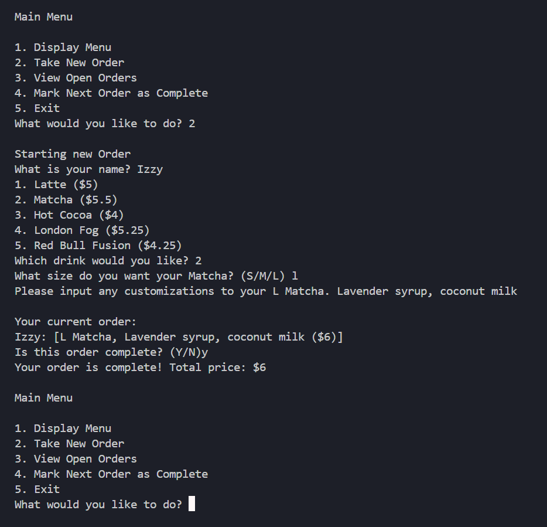
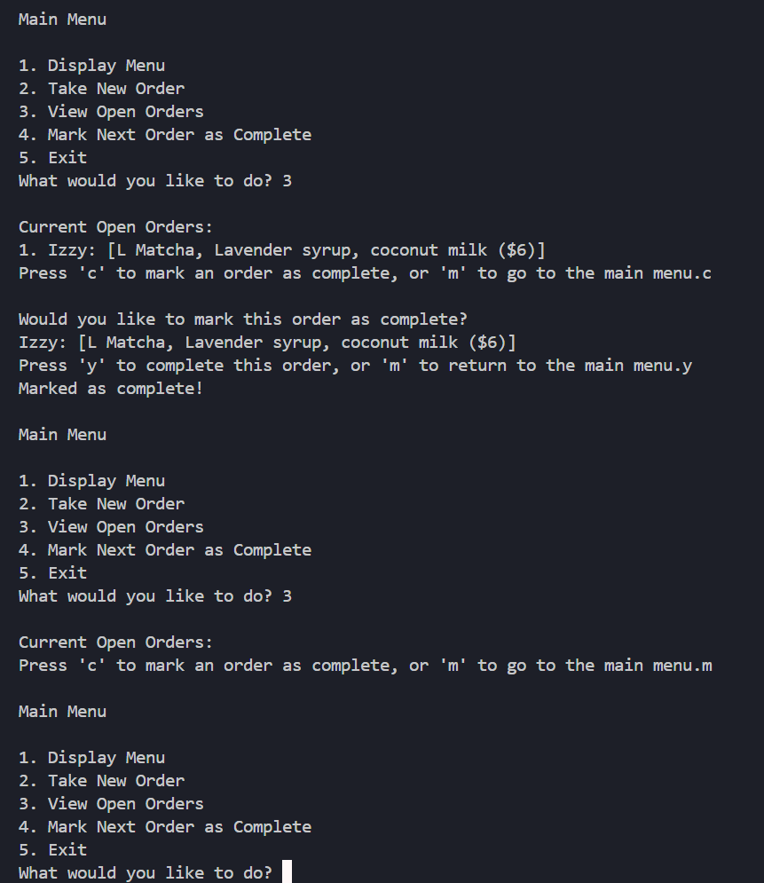
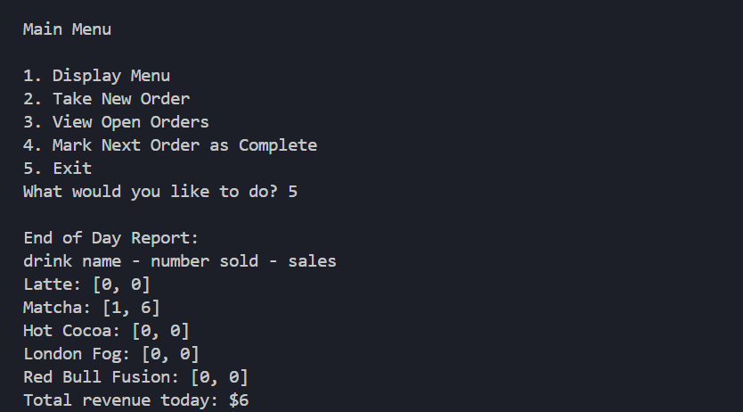

## Class Implementations

**Drink**
- A custom class
- Contains `name`, a string representing the name of the drink.
- Contains `size`, a string representing the size of the drink. Must be in ['S','M','L'].
- Contains `price`, a float representing the price of thr drink. This is derived from a dictionary of strings (drink names) and more dictionaries. The internal dictionaries contain strings (drink sizes) and floats (price).
- Contains `customization`, a string entered by the user. 

**Customer Order**
- A custom class
- Contains `cust_name`, a string representing the name of the customer who ordered it.
- Contains `order`, an `Array` of `Drink` objects representing the items ordered.
- Again we need to iterate through the drinks in the order, as well as be able to add new ones to it. Iterating still has linear complexity, while appending has constant complexity. Because Arrays support fast appending and can grow dynamically it was the best choice for this.

**Menu**
- A `list` of strings
- The strings each represent a drink and the amount a medium size would cost.
- Looping through a list has a linear complexity, indexing a list has a constant complexity. A list is relatively small in computer storage, and we don't need access to any operations besides iterating and indexing. This makes a list a simple and compact choice.

**In Progress Orders**
- A `CircularQueue` of `CustomerOrder` objects
- The orders made follow the First-In-First-Out principle, which is built into the `CircularQueue` with `enqueue` and `dequeue`. Both methods are constant time, and iterating is linear. 

**Completed Orders**
- An `Array` of `CustomerOrder` objects
- Again, we need to be able to iterate (linear time) and append (constant time) to this structure, so an Array was the best choice.

**Drink Counts**
- A `dictionary` of strings and lists.
- The keys are strings corresponding to the drink names.
- The values are lists with two items. The first item is an `integer` corresponding to the number of that drink sold, the second is a `float` corresponding to the money made from those drinks.
- This makes is easy to edit the count and money as lists are mutable, and we can easily index by the drink name with dictionary keys.

**Bistro System**
- A custom class
- Contains `Menu`, the Menu structure defined above.
- Contains `in_progress_orders`, the In Progress Orders structure defined above.
- Contains `completed_orders`, the Completed Orders structure defined above.
- Contains `drink_counts`, the Drink Counts structure defined above.
- Has methods to display and take input for each 'screen' the user can interact with.

## How to Run
1. Start the system by running Project 3 under the Run and Debug tab.
2. To select options from numbered menus, enter the number next to the option you want.
3. In other scenarios, the terminal will prompt you to enter a specific key for certain options.

## Sample Runs
- Starting the program, choosing to start a new order
- Ordering a Large Matcha with Lavender and Coconut milk for Izzy
- Returning to the main menu

- Chosing to view the current open orders, then complete the next order
- Mearking the next order as complete and returning to the main menu
- Viewing the open orders queue again and seeing it is empty

- Choosing to exit the program
- Viewing the daily summary showing one Matcha was sold for $6, and the total revenue for the day was $6

## Issues to be aware of
- The `in_progress_orders` queue is initialized with a max size of 10 objects, meaning if there are more than 9 open orders at a time no new ones can be added.
- Entering the wrong key will cause the program to exit.

## Future Aspirations
- I would love to add more fluidity in ordering, like a way to go back and edit/cancel orders that haven't been completed yet.
- Additionally, handling incorrect keys without exiting would greatly improve quality of life.